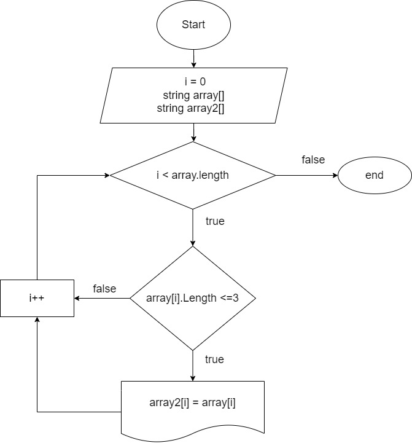

# Решение задачи

**1.** Создали строковый массив с размером 5 элементов. 

**2.** Создали метод заполнения *(FillArray)* массива путем прокрутки индекса элементов. Все элементы массива вводятся пользователем с клавиатуры.

**3.** Создали метод печати массива *(PrintArray)*.

**4.** Создали метод фильтрации элементов массива *(Sorted)*, позволяющий вывести элементы с размером меньше или равно 3. В случае, если в заданном массиве нет подходящих под условие элементов, то выводится ссообщение "В данном массиве нет элементов меньше или равно 3-м!"

# Дополнительная информация
- Добавлена блок-схема.

- Добавлен фильтрующий файл gitignore.